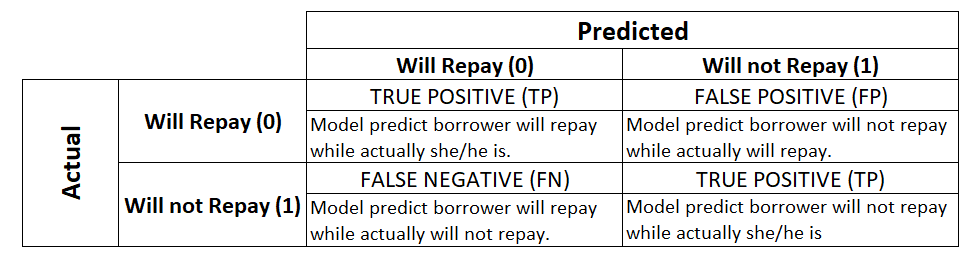
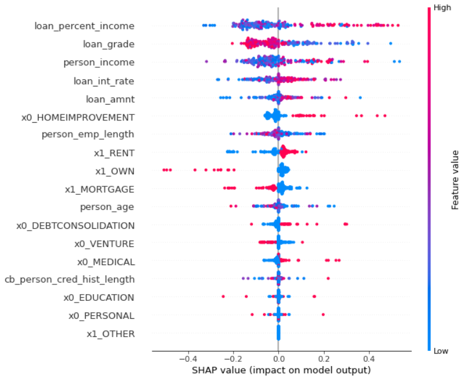
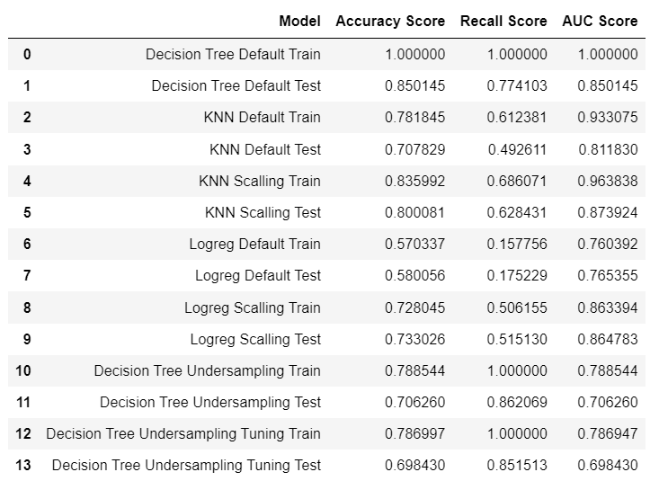

# Loan-Repayment-Analysis
From this project, i will explore which borrower will repay or not so the company can prevent the loss because of the borrower not repay and keep the borrower who can repay still can lend the money.

For full process, please visit my portofolio on <a href="https://github.com/Juantonios1/Loan-Repayment-Analysis/blob/main/Loan%20Repayment%20Prediction%20Analysis%20v1.ipynb">Loan Repayment Analysis</a>.  

<!-- TABLE OF CONTENTS -->

  
Table of Content

  <ol>
    <li>
      <a href="#business-background">Business Background</a>
    </li>
    <li>
      <a href="#data-understanding">Data Understanding</a>
    </li>
    <li>
      <a href="#exploratory-data-analysis">Exploratory Data Analysis</a>
    </li>
    <li><a href="#data-analytics">Data Analytics</a></li>
    <li><a href="#data-preprocessing">Data Preprocessing</a></li>
    <li><a href="#model-selection">Model Selection</a></li>
    <li><a href="#explainable-and-interpretable-machine-learning">Explainable and Interpretable Machine Learning</a></li>
    <li><a href="#conclusion">Conclusion</a></li>
    <li><a href="#contributors">Contributors</a></li>
  </ol>

## Business Background
**Context :**  
Credit risk refers to the uncertainty faced by an organization while lending money to an individual, business, or organization. Credit risk analysis is defined as a detailed review, and inspection done by the lending organization regarding the borrower about their financial background, modes of earning, and the capability to repay the borrowed credit. This gives the lending enterprises a fair idea regarding the credit-paying capabilities of the borrower. In simple terms, credit risk refers to the potential for loss due to the failure of a borrower to make a payment when it is due. The risk is mainly for the lender and it can include complete or partial loss of principal amount, loss of interest, and disruption of cash flow. The source of this dataset is from <a href="https://www.kaggle.com/laotse/credit-risk-dataset">Kaggle</a>.  

**Problem Statement :**  
The purpose of credit risk analysis is to determine the creditworthiness of the borrower based on his financial background and repayment history and capacity. It means to determine the eligibility of the person to receive the amount of money he is requesting without causing any kind of complete or partial loss to the lending organization. Having a credit risk analysis done provides lenders with a complete profile of the customer and an insight that enables them to anticipate customer behavior. By employing various analytics techniques, lenders can save their time, money, and resources to target the right customers and monitor or anticipate the risk involved for a more profitable business. But to achieve that purpose we need the model to predict which borrower will repay or not.

**Goals :**  
To know which borrower will repay or not so the company can prevent the loss because of the borrower not repay and keep the borrower who can repay still can lend the money.

**Metric Evaluation :**    
Determine the suitable metric to rate the performance from the model. 

## Data Understanding

| Feature      	| Description                                                                                                                                                                                                               	|
|--------------	|---------------------------------------------------------------------------------------------------------------------------------------------------------------------------------------------------------------------------	|
| person_age         	| Age                                                                                                                                                                                                           	|
| person_income      	| Annual Income                                                                                                                                                                                 	|
| personhomeownership    	| Home ownership                                                                                                                                                                               	|
| personemplength          	| Employment length (in years)|
| loan_intent        	| Loan intent                     	|
| loan_grade       	| Loan grade                                             	|
| loan_amnt   	| Loan amount	|
| loan_int_rate        	| Interest rate                      	|
| loan_status         	| Loan status (0 is non default 1 is default)             	|
|loanpercentincome   	| Percent income	|
|cbpersondefaultonfile         	| Historical default                                	|
|cbpresoncredhistlength         	| Credit history length                            |
## Exploratory Data Analysis
At this stage, a brief analysis of the data will be carried out, as follows:
* Distribution Data Numerical
* Data Cardinalities
* Data Correlation
  * WOE & IV
  * Chi Squared
  * ETA Squared 
* Identify Missing Values
* Data Imbalance
* Identify Outliers

## Data Preprocessing
At this stage, data preparation and processing will be carried out before being used as a data model, as follows:
* Inconsistent Variable
* Filling Missing Value
* Export Preprocessing Dataset : <a href="https://github.com/Juantonios1/Loan-Repayment-Analysis/blob/main/Preprocessing%20Loan%20Repayment%20Dataset.csv">Preprocess Dataset</a>.   
* Transformer
* Splitting Data
* Get Features Names

## Data Analytics
Visualization using Tableau, Source : <a href="https://public.tableau.com/app/profile/juan1691/viz/LoanRepaymentAnalysis/LoanRepaymentAnalysis?publish=yes">Visualization Analysis</a>   
At this stage, another information analysis will be carried out, as follows:
* Loan Grade Information
* Home Ownership Information
* Employee Length & Credit History Length
* Loan Intent & Status Information

## Model Selection
At this stage will be done making and optimizing the machine learning model, as follows:
* Model Benchmark (KNN, Decision Tree, Logistic Regression)
* Imbalance Method : Undersampling
* Hyperparameter Tuning : Grid Search

## Explainable and Interpretable Machine Learning
At this stage there will be an explanation in the decision making of the machine learning model, in the following ways:
* SHAP  

 `loan_percent_income`,`person_income`,`loan_grade`,`loan_int_rate`,`loan_amount`,`person_emp_length` are most influence factor to customer repay or not.

## Conclusion 
We conclude our result and give recommendation based on it
* Process Summary : 
 * 
* Business Insight :
  * Our Data customer who use our loan product show their age between 20 and 30 and annual income between 50000 and 70000, and their employment length is low (usually their financial still not stable).
  * The average percent income from interest is 0.17%
  * For full recommendation, please check main file
* Recommendation : 
  * Business Development and Marketing team can focus to customer with age >20 and <30 years and annual income >50000 and <70000 to boost the growth beside they will repay or not.
  * Because of the average percent loan income from interest, we can promote the loan length which loan rate is 0.17%
  * For full recommendation, please check main file

## Final Model
For deployment, model must save in pickle and my final model is  <a href="https://github.com/Juantonios1/Loan-Repayment-Analysis/blob/main/dt%20cs.pickle">Loan Repayment Model</a>

## Contributors:
Juan Antonio Suwardi - antonio.juan.suwardi@gmail.com  
